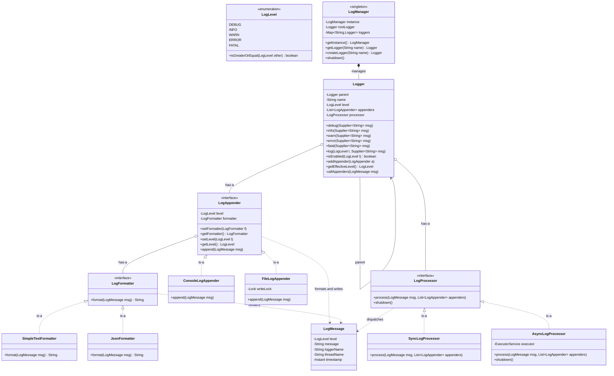

# Logging Framework — Class Diagram

```mermaid
classDiagram
    class LogLevel {
        <<enumeration>>
        DEBUG
        INFO
        WARN
        ERROR
        FATAL
        +isGreaterOrEqual(LogLevel other) boolean
    }

    class LogMessage {
        -LogLevel level
        -String message
        -String loggerName
        -String threadName
        -Instant timestamp
    }

    class LogFormatter {
        <<interface>>
        +format(LogMessage msg) String
    }
    class SimpleTextFormatter {
        +format(LogMessage msg) String
    }
    class JsonFormatter {
        +format(LogMessage msg) String
    }

    class LogAppender {
        <<interface>>
        -LogLevel level
        -LogFormatter formatter
        +setFormatter(LogFormatter f)
        +getFormatter() LogFormatter
        +setLevel(LogLevel l)
        +getLevel() LogLevel
        +append(LogMessage msg)
    }
    class ConsoleLogAppender {
        +append(LogMessage msg)
    }
    class FileLogAppender {
        -Lock writeLock
        +append(LogMessage msg)
    }

    class LogProcessor {
        <<interface>>
        +process(LogMessage msg, List~LogAppender~ appenders)
        +shutdown()
    }
    class SyncLogProcessor {
        +process(LogMessage msg, List~LogAppender~ appenders)
    }
    class AsyncLogProcessor {
        -ExecutorService executor
        +process(LogMessage msg, List~LogAppender~ appenders)
        +shutdown()
    }

    class Logger {
        -Logger parent
        -String name
        -LogLevel level
        -List~LogAppender~ appenders
        -LogProcessor processor
        +debug(Supplier~String~ msg)
        +info(Supplier~String~ msg)
        +warn(Supplier~String~ msg)
        +error(Supplier~String~ msg)
        +fatal(Supplier~String~ msg)
        +log(LogLevel l, Supplier~String~ msg)
        +isEnabled(LogLevel l) boolean
        +addAppender(LogAppender a)
        +getEffectiveLevel() LogLevel
        -callAppenders(LogMessage msg)
    }

    class LogManager {
        <<singleton>>
        -LogManager instance
        -Logger rootLogger
        -Map~String,Logger~ loggers
        +getInstance() LogManager
        +getLogger(String name) Logger
        +createLogger(String name) Logger
        +shutdown()
    }

    LogFormatter <|.. SimpleTextFormatter : is-a
    LogFormatter <|.. JsonFormatter : is-a
    LogAppender <|.. ConsoleLogAppender : is-a
    LogAppender <|.. FileLogAppender : is-a
    LogProcessor <|.. SyncLogProcessor : is-a
    LogProcessor <|.. AsyncLogProcessor : is-a

    LogAppender o-- LogFormatter : has-a
    Logger o-- LogAppender : has-a
    Logger o-- LogProcessor : has-a
    Logger --> Logger : parent
    LogManager *-- Logger : manages

    LogAppender ..> LogMessage : formats and writes
    LogFormatter ..> LogMessage : renders
    LogProcessor ..> LogMessage : dispatches
```
